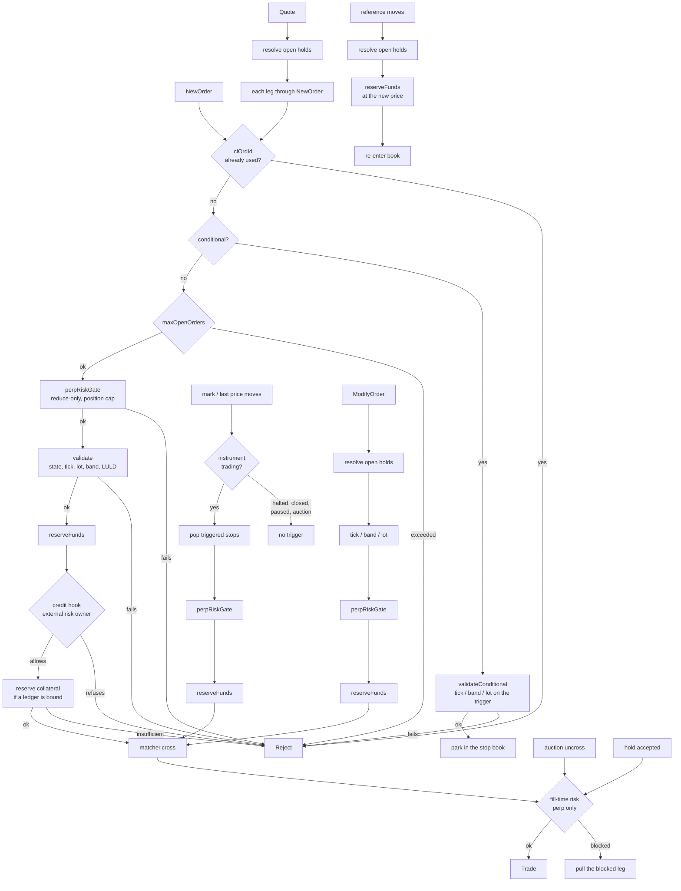

# Matching

## Two books, one interface

Matching needs individual orders -- to keep time priority, cancel by id, and
refill icebergs -- so the matcher's resting books are distinct from
`NLevelOrderBook`, which aggregates per-level totals for market data. The
performance book `LadderBook` lives in core (`flox/book/ladder_book.h`); the
reference `MatchingBook` lives in the module (`flox-venue/matching_book.h`).

| Book | Shape | Use |
|---|---|---|
| `MatchingBook` | `std::map` + `std::list`, allocates | Reference oracle. Easy to reason about. |
| `LadderBook` | tick-indexed dense ladders, intrusive FIFO over a node pool, occupancy bitmap | Performance path. O(1) best, O(1) next level, no steady-state allocation. |

They are interchangeable (`MatchingEngine<MatchingBook>` /
`MatchingEngine<LadderBook>`), and a differential fuzz keeps them
observationally identical; see [Verification](verification.md).

```cpp
LadderBook book(LadderBook::Config{
    .basePriceRaw = 0,
    .tickRaw      = Price::fromDouble(0.01).raw(),
    .numLevels    = 20000,     // price band height, in ticks
    .maxOrders    = 1 << 20}); // node pool capacity
```

## Matching policies

`Matcher<Book>` implements the allocation rule:

- **Price-time (FIFO)**, the default. Best price first; within a price, oldest
  order first.
- **Pro-rata.** Allocation at a level is proportional to resting size, with the
  usual leftover pass. Last-look orders are refused at admission on pro-rata
  instruments (`LastLookUnsupported`): a held slice cannot be carved out of a
  proportional round, and silently filling the maker as firm -- the old
  behaviour -- misrepresented the quote. **Defensive second line**: a resting
  `lastLook` maker met by a pro-rata allocation (reachable only if a caller
  bypassed `validate()`) is **skipped, never filled as firm** -- it is
  excluded from the level total and from the allocation, the remaining firm
  participants split the aggressor exactly as they otherwise would, and
  `Matcher::skippedLastLookProRata()` (surfaced as
  `MatchingEngine::skippedLastLookProRata()`) counts the event. A level whose
  firm size is zero stops the sweep, so the aggressor residual follows its
  TIF instead of a fabricated fill.

```cpp
Matcher<MatchingBook> m(MatchPolicy::ProRata);
m.setStpGroup(/*account*/ 10, /*firm*/ 1);   // firm-scope self-trade prevention
```

Firm-group STP membership is engine state, not startup wiring: runtime
changes arrive as the sequenced `SetStpGroup` command (control-plane
`setStpGroup` verb), so they journal, ride checkpoints and replay with the
rest of matching. `group = 0` removes a membership.

### Self-trade prevention

Four modes, applied when the aggressor and the maker share an STP scope (the
account, or the firm group registered via `setStpGroup`):

| Mode | Effect |
|---|---|
| `CancelNewest` | the incoming order is killed |
| `CancelOldest` | the resting order is pulled, matching continues |
| `CancelBoth` | both go |
| `Decrement` | the smaller leg is removed, the larger is reduced by that size; no trade |

STP interacts with `FOK`: an all-or-none order cannot count liquidity it would
never be allowed to trade with, so the precheck excludes same-scope resting
size.

A mass quote carries the mode too, and both of its legs inherit it -- so a
maker that quotes rather than sending individual orders is not left without the
control.

STP also interacts with **last look**: the maker it pulls may have a hold open,
so the hold is resolved (rejected, liquidity restored) before the order is
removed -- the same order every engine-side cancel path follows. Removing first
would release the collateral the hold still had to settle from.

### Live risk limits

The band, the fat-finger caps, the per-account order cap, the position cap and
the margin requirement are changed with the sequenced `SetRiskLimits` command
(control-plane verb `setRiskLimits`). A field mask says which limits the record
carries, so raising one cannot zero another by omission.

The direct setters on the engine remain for pre-start wiring. On a running
engine they apply immediately and ride nothing: a restart reverts them and a
replica replaying the journal never sees the change. Use the command.

### Delisting

`AdminAction::Delist` withdraws an instrument from trading and pulls the
resting book with it. A halt promises the instrument comes back and a closed
session promises the next one; delisting promises neither, so leaving orders
resting would leave them waiting for an open that is not coming. New orders are
rejected with `InstrumentDelisted`, which says that rather than promising a
return.

It outranks halt, session and auction state: reopening the session does not
make a delisted instrument tradeable. `Relist` reverses it -- an irreversible
operator action is one mistake away from needing a restart to undo.

### Admission profiles

Counterparties have different rights. One routes flow it manages itself and
should never leave an order resting here; another posts and pulls quotes, where
cancel/replace is the main operation. The rights are set per account and
checked on entry.

| Field | Meaning |
|---|---|
| `allowedTypes` | bitmask over `OrderType`; 0 = no restriction |
| `allowedTif` | bitmask over `TimeInForce`; 0 = no restriction |
| `deny` | `DenyResting`, `DenyAmend`, `DenyCancel`, `DenyQuote` |

An absent profile permits everything, so an engine never given one behaves as
before. `DenyResting` rejects GTC, GTD and post-only on admission rather than
killing the residual afterwards: an order resting here that the sender does not
track will not be reconciled, and nothing looks wrong until it fills. The
rejection happens before the `clientOrderId` is consumed, so a corrected
message can be resent under the same id.

It also refuses **every** order from that counterparty while the instrument is
in a call auction, whatever its time in force. An auction rests everything it
admits -- there is no matching to be immediate about, so an IOC accumulates in
the book like any other order and sits there until the uncross. A counterparty
that does not track resting orders therefore cannot take part in one: its order
would sit in the book for the length of the auction while it believes the order
filled or died on arrival, and at the uncross it could trade against its own
other side.

The profile arrives as the sequenced `SetAdmissionProfile` command
(control-plane verb of the same name), so it journals, survives checkpoints,
enters the state hash and replays. `MatchingEngine::admissionRejects()` counts
the rejections; a non-zero value means a counterparty is sending something its
profile does not allow.

## Order types and time in force

`NewOrder` carries the full venue vocabulary:

- **Types**: `LIMIT`, `MARKET`, `STOP_MARKET`, `STOP_LIMIT`, `TAKE_PROFIT*`,
  `TRAILING_STOP`.
- **TIF**: `GTC`, `IOC`, `FOK`, `GTD` (with `expiryNs`), `POST_ONLY`.
- **Iceberg.** `visibleQuantity` shows a peak and hides the rest; the hidden
  reserve is real liquidity for matching and stays out of the public feed.
- **Peg.** `PegRef::{Bid,Ask,Mid}` plus a signed offset; repriced at each
  submit boundary, tick-aligned, clamped so it never crosses.
- **OCO.** `ocoGroup`; a fill on one leg cancels its siblings.
- **Reduce-only.** Perp orders that may only reduce a position, re-capped on
  submit, trigger, modify -- and re-measured at fill time against the position
  as it is then (see [Risk](risk.md)).

## The engine

`MatchingEngine<Book>` owns the lifecycle around the matcher: validation, risk
gates, stops, expiry, pegs, auctions, clearing, and event emission.

```cpp
SymbolConfig cfg;
cfg.id = 1;
cfg.tickSize = Price::fromDouble(0.01);
cfg.minPrice = Price::fromDouble(1);      // 0 = unchecked
cfg.maxPrice = Price::fromDouble(1000);
cfg.baseAsset = 0;
cfg.quoteAsset = 1;

MatchingEngine<MatchingBook> venue(cfg, [](const OutboundEvent& e) { publish(e); });
venue.submit(InboundCommand{order}, tsNs);
```

Every state-mutating input is an `InboundCommand`: `NewOrder`, `CancelOrder`,
`ModifyOrder`, `MassCancel`, `Quote`, `LastLookDecision`, `SetMark`,
`ApplyFunding`, `AdminCmd`, `TimeTick` (idle time sweep). That is what makes
deterministic replay possible; see [Runtime and recovery](runtime.md).

### Pre-trade risk

Configured on `SymbolConfig` and adjustable live, so an operator can tighten
limits during volatility without a restart:

| Control | Config | Live setter |
|---|---|---|
| Tick / lot / min quantity | `tickSize`, `lotSize`, `minQty` | -- |
| Price band (collar) | `minPrice`, `maxPrice` | -- |
| Fat finger | `maxOrderQty`, `maxOrderNotional` | `setFatFinger` |
| LULD volatility band | `luldBps`, `luldHaltNs` | `setLuldBps` |

LULD (limit-up/limit-down) gates both sides of a trade. A limit order priced
outside the band around the last price is rejected pre-trade (`LuldBreach`) and
trips a timed pause. A market order has no limit to gate it, so it can sweep the
book and print outside the band; that breaching print stands, but it trips the
same pause so subsequent trading halts (the exchange-style volatility
interruption) -- a stop cascade that prints out of band trips it the same way.
Before the first trade there is no reference price, so no band exists yet.

| Max resting orders per account | `maxOpenOrders` | `setMaxOpenOrders` |
| Max position (perp) | `maxPositionQty` | `setPositionLimit` |
| Margin requirement | `initialMarginBps`, `maintenanceMarginBps` | `setMarginBps` |
| Halt | `halted` | `setHalted` |

### Market-maker features

- **Last look.** `lastLookWindowNs`: the maker holds a fill and answers with
  `LastLookDecision`. See the full lifecycle below.
- **MMP.** `setMmp(account, qtyLimit, windowNs)`: if an account is filled
  faster than its limit inside the window, its book is pulled and
  `MmpTriggered` fires.
- **Mass quote.** `Quote` replaces both sides of a two-sided quote atomically,
  by id: the engine cancels `bidId` and `askId` and re-posts them at the new
  prices, so a maker keeps one pair of ids and reuses it. The quote carries its
  own `stp` and `lastLook`, which both legs inherit. A maker quoting
  continuously is the participant that most needs self-trade prevention, and
  the one whose quotes are tight enough to want holding -- without those two
  fields it had to choose between the primitive built for two-sided quoting and
  the controls that make two-sided quoting safe.

### Last-look lifecycle

`lastLookWindowNs > 0` enables last look venue-wide; `0` disables it entirely
(the matcher hook is never installed, so a `lastLook`-flagged order fills like
any other maker). When an aggressor hits a resting `lastLook` maker, the hit
size is reserved OUT of the book, `FillHeld` is emitted (with `heldId` and the
maker's `makerDisplayAfter` for the public feed), and the maker has the window
to answer with `LastLookDecision{heldId, accept}`.

- **Ownership.** Only the maker account that owns the held quote may decide;
  any other account gets `OrderRejected{NotOrderOwner}` and the hold stands.
- **Accept** prints the trade at the held price/size and settles normally.
- **Reject / timeout** (`lastLookAcceptOnTimeout=false`) destroys no
  liquidity:
  - The maker's held quantity returns to its price level **at the tail**
    (as-if the maker re-entered; time priority is lost). If the maker order was
    canceled between hold and reject there is nothing to restore -- but the
    cancel paths below resolve holds *first*, so that case cannot arise: a
    missing maker here means it was fully held out of the book, and it is
    rebuilt.
  - The taker's held quantity returns and follows the order's TIF: GTC/GTD
    rest at the taker's limit (tail; combined with any already-resting
    remainder via `OrderModified`), IOC/FOK/MARKET residuals are canceled with
    the matching residual reason. The restored taker rests **passively** -- it
    does not re-aggress, so the book may be transiently crossed against the
    rejecting maker until new flow arrives.
  - `FillRejected{heldId, takerId, makerId, price, qty}` reports what did not
    happen.
- **Timeout on a quiet symbol.** Hold expiry runs on every submit AND on
  `tick(nowNs)` (idempotent sweep). Under `SequencedShard`, pass
  `idleSweepIntervalNs > 0` to arm the idle sweeper: while holds are open it
  injects a `TimeTick` command through the sequenced stream (journaled, so
  replay reproduces the timeout at the same point).
- **Cancel-while-held.** Every path that removes or reshapes an order --
  `CancelOrder`, `ModifyOrder`, `Quote` replace, GTD expiry, OCO, peg reprice,
  `MassCancel`/MMP/liquidation (account scope), `HaltAndCancelAll` (all) --
  deterministically resolves (rejects) the affected holds FIRST. An accept
  after the cancel is impossible (`UnknownOrder`), and reservations release
  exactly once: the held slice stays reserved until its hold resolves, then
  either settles (accept) or is released/re-rests (reject).
- **FOK vs last look.** Last-look liquidity is non-firm: it never counts
  toward the FOK all-or-none precheck, and a FOK whose crossing range contains
  ANY last-look maker is rejected `FillOrKillUnfulfillable` outright -- the
  sweep is strict price-time, so a last-look maker inside the range could be
  hit before the FOK completes, and a partial execution followed by a hold
  would violate all-or-none. A last-look maker priced outside the crossing
  range does not affect the FOK.
- **Public feed.** `MarketDataPublisher` shrinks the maker's level on
  `FillHeld` (by `makerDisplayAfter`) and follows the restore events
  (`OrderModified`/`OrderAccepted`) on reject -- after any sequence of
  hold/accept/reject the published depth equals the matching book.
- **Wire.** SBE templates 17 (`FillHeld`) / 18 (`FillRejected`) in
  `order-entry-sbe.xml`; REST/JSON `{"type":"fillHeld"|"fillRejected", ...}`.
  FIX has no honest ExecType for a pending held fill, so `FillHeld` uses the
  documented custom value `150=U` and `FillRejected` uses `150=H` (Trade
  Cancel), both with custom tags `20001=heldId`, `20002=makerId`.
- Pro-rata instruments do not honour last look (documented matcher scope
  limitation), and admission refuses the combination. If one appears anyway
  (admission bypassed), the pro-rata allocation SKIPS that maker rather than
  filling it as firm, bumping `skippedLastLookProRata()` -- see the pro-rata
  policy above.

### Client order id dedup

`clientOrderId` (FIX tag 11, SBE/REST `clientOrderId`) is deduplicated **per
account** at the engine: a `NewOrder` whose `clientOrderId` was already seen by
that account rejects with `DuplicateClientOrderId` and leaves the book
untouched -- whether the original is still resting, filled, or canceled. That
is what makes a client resend after an ambiguous disconnect safe.
`clientOrderId == 0` means "not set" and is never deduplicated. The dedup
window is the engine session (uptime): the index is rebuilt by the same
submits during journal replay, so post-restart behaviour is identical to live;
rotating/compacting the index is a future checkpoint concern.

Internal `OrderId`s (`NewOrder.id`) are a separate namespace: the engine
requires them to be **globally unique across accounts** (duplicates reject only
while the earlier order is alive). Generating unique ids is the
gateway's/client's responsibility -- that is the honest boundary.

### Auctions and halts

Sequenced through `AdminCmd`, so they survive replay:

- `BeginPreOpen`: accumulate without matching (a crossed book is allowed).
- `OpenContinuous`: uncross at the single volume-maximising price, then resume.
- `ResumeAuction`: clear a halt into a re-opening auction.
- `HaltAndCancelAll`: emergency halt that also pulls the resting book.
- `Halt` / `Resume`.

## Order paths and the gates on them

Eight paths admit or re-admit an order into matching, and each applies the
pre-trade checks itself. A stop that fires is not covered by the validation its
submission passed: the instrument may have halted in between.



The table below is the same thing checked against the source, including gates
inherited through delegation -- a quote runs every new-order gate because each
leg goes through that path.

| path | state | dedup | tick/lot/band | perp risk | credit hook | collateral | self-trade | fill-time risk | holds |
|---|---|---|---|---|---|---|---|---|---|
| new order | yes | yes | yes | yes | yes | yes | yes | - | - |
| conditional (parked) | yes | - | yes | yes | yes | yes | - | - | - |
| stop trigger | yes | - | yes | yes | yes | yes | yes | - | - |
| modify | yes | - | yes | yes | yes | yes | yes | - | yes |
| quote (per leg) | yes | yes | yes | yes | yes | yes | yes | - | yes |
| peg reprice | - | - | yes | yes | yes | yes | yes | - | yes |
| auction uncross | - | - | - | yes | - | - | yes | yes | - |
| hold accept | - | - | - | - | - | - | - | yes | yes |

Self-trade prevention applies under both matching policies and in the auction,
and where it reads the mode from differs. In continuous trading it comes off
the aggressor: pro-rata resolves every same-scope maker at the level before
computing the split, price-time resolves each one as the sweep reaches it, and
both call `applySelfTradePrevention`. A modify carries the mode of the order it
replaces. An auction has no aggressor, so the mode comes off each resting order
(the book stores it for that) and applies from its owner's side.

Two blanks in the table are intentional. A peg reprice does not re-check
instrument state: it only runs on a submit, and that submit is rejected first
when trading is stopped. The auction uncross does not re-validate prices or
take collateral, because every order in the book passed both on admission and
the uncross only picks the clearing price. Both cases are covered by tests.

`test_venue_gate_coverage.cpp` asserts these as properties rather than as a
list: each admission path must ask the credit hook for the order it admits,
nothing may print while the instrument is not trading (under both trigger
references), and a conditional order must obey tick, band and lot. Removing any
one guard makes it fail -- verified by mutation, one guard at a time.
