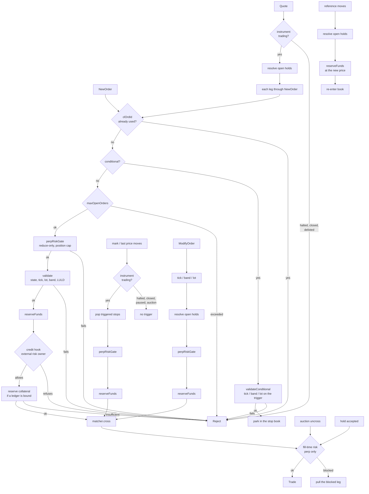

# Matching

## Two books, one interface

Matching needs individual orders -- to keep time priority, cancel by id, and
refill icebergs -- so the matcher's resting books are distinct from
`NLevelOrderBook`, which aggregates per-level totals for market data. The
performance book `LadderBook` lives in core (`flox/book/ladder_book.h`); the
reference `MatchingBook` lives in the module (`flox-venue/matching_book.h`).

| Book | Shape | Use |
|---|---|---|
| `MatchingBook` | `std::map` + `std::list`, allocates | Reference oracle. Easy to reason about. |
| `LadderBook` | tick-indexed dense ladders, intrusive FIFO over a node pool, occupancy bitmap | Performance path. O(1) best, O(1) next level, no steady-state allocation. |

`LadderBook`'s O(1) claims are per-operation with no amortised term, which is
what a matching pass needs: best and next-level are a bitmap word scan, and
order id -> node is an open-addressed table with linear probing and
**backward-shift deletion**. There are no tombstones and therefore no rehash
-- a cancel closes the hole by moving back the tail of its own probe chain, so
the table after any amount of churn is the table the resting orders would have
built from empty, and a lookup costs what it cost on the first order of the
day. Nothing allocates after construction: the ladders, the node pool and the
id table are all sized by `Config`.

They are interchangeable (`MatchingEngine<MatchingBook>` /
`MatchingEngine<LadderBook>`), and a differential fuzz keeps them
observationally identical over a random stream; the golden replay corpus
(`venue/tests/test_venue_golden_replay.cpp`) runs the SAME hand-picked
scenarios on both and checks `LadderBook` against the exact numbers recorded
for `MatchingBook` -- one table, because the two are contractually required
to agree. See [Verification](verification.md).

They agree **within the ladder's bounds**, which is the one thing the map book
does not have. `LadderBook` is finite in both price (`numLevels` ticks from
`basePriceRaw`) and order count (`maxOrders`), and an order it cannot take it
**refuses** -- `addResting` answers `BookAddResult` and the engine turns the
answer into a report rather than acking an order the book never took:

| refusal | engine answer |
|---|---|
| price with no level (below `basePriceRaw`, or past the top of the ladder) | `OrderRejected` / `CancelRejected` with `InvalidPrice` |
| node pool exhausted (`full()`) | `OrderRejected` with `BookCapacityExceeded` |
| either one, for an order that has already printed | `OrderCanceled` with `BookRefused` -- a reject cannot follow its own executions |

`validate()` (and the amend path) ask `canRest()` before the order is committed
to matching, so an unrepresentable price is refused before it can trade;
`full()` is asked at the last node, after matching, because a marketable order
frees nodes as it consumes makers and must not be refused for a pool its own
fills empty. A deployment sizes `numLevels`/`basePriceRaw` to cover the
instrument's collar (`minPrice`/`maxPrice`) and `maxOrders` to cover its book:
within those bounds the two books are interchangeable, outside them
`MatchingBook` (a `std::map`, bounded only by the allocator) accepts what
`LadderBook` refuses.

The level of a price is `floor((price - base) / tick)`, floored and not
truncated: truncation mapped the whole window `(base - tick, base)` onto level
0 -- the base level -- so an ask at 995 with a base of 1000 was filed under
1000 while the order kept its own price, and the ladder quoted liquidity at a
price nothing rested at.

```cpp
LadderBook book(LadderBook::Config{
    .basePriceRaw = 0,
    .tickRaw      = Price::fromDouble(0.01).raw(),
    .numLevels    = 20000,     // price band height, in ticks
    .maxOrders    = 1 << 20}); // node pool capacity
```

## Matching policies

`Matcher<Book>` implements the allocation rule:

- **Price-time (FIFO)**, the default. Best price first; within a price, oldest
  order first.
- **Pro-rata.** Allocation at a level is proportional to resting size, with the
  usual leftover pass. Last-look orders are refused at admission on pro-rata
  instruments (`LastLookUnsupported`): a held slice cannot be carved out of a
  proportional round, and silently filling the maker as firm -- the old
  behaviour -- misrepresented the quote. **Defensive second line**: a resting
  `lastLook` maker met by a pro-rata allocation (reachable only if a caller
  bypassed `validate()`) is **skipped, never filled as firm** -- it is
  excluded from the level total and from the allocation, the remaining firm
  participants split the aggressor exactly as they otherwise would, and
  `Matcher::skippedLastLookProRata()` (surfaced as
  `MatchingEngine::skippedLastLookProRata()`) counts the event. A level whose
  firm size is zero stops the sweep, so the aggressor residual follows its
  TIF instead of a fabricated fill.

```cpp
Matcher<MatchingBook> m(MatchPolicy::ProRata);
m.setStpGroup(/*account*/ 10, /*firm*/ 1);   // firm-scope self-trade prevention
```

Firm-group STP membership is engine state, not startup wiring: runtime
changes arrive as the sequenced `SetStpGroup` command (control-plane
`setStpGroup` verb), so they journal, ride checkpoints and replay with the
rest of matching. `group = 0` removes a membership.

### Self-trade prevention

Four modes, applied when the aggressor and the maker share an STP scope (the
account, or the firm group registered via `setStpGroup`):

| Mode | Effect |
|---|---|
| `CancelNewest` | the incoming order is killed |
| `CancelOldest` | the resting order is pulled, matching continues |
| `CancelBoth` | both go |
| `Decrement` | the smaller leg is removed, the larger is reduced by that size; no trade |

`Decrement` measures each leg by what it holds, not by what it shows. On an
iceberg that is the displayed peak plus the hidden reserve, and the cut comes
out of the reserve first, so a decrement leaves the peak intact while there is
reserve behind it. Measuring the peak alone would call a large iceberg the
smaller leg and cancel the whole thing against an aggressor a fraction of its
size.

STP interacts with `FOK`: an all-or-none order cannot count liquidity it would
never be allowed to trade with, so the precheck excludes same-scope resting
size.

A mass quote carries the mode too, and both of its legs inherit it -- so a
maker that quotes rather than sending individual orders is not left without the
control.

In the auction the verdict comes off both resting orders rather than an
aggressor, and the uncross loop depends on it naming an action: the loop
re-peeks the same best bid and best ask every pass, so a verdict that
decrements nothing and cancels neither leg would leave the book untouched and
come round to the identical pair forever. A verdict that engages without
naming an action is therefore carried out as `CancelBoth` -- the pair must not
print, both legs are crossing, and nothing in such a verdict says which side to
keep. It is unreachable through the decoders, which refuse a mode outside
`STPMode` at the wire ([perimeter](perimeter.md#hostile-input)); the uncross
does not rely on that being the only way in.

### Last look, and the option inside it

A held fill is an option the maker holds for the length of the window, and an
option nobody can see the exercise of is one that gets exercised in one
direction. Over enough holds, a maker free to answer as it likes fills the ones
that moved its way and refuses the ones that did not; the taker sees only a
reject rate and cannot tell that from an honest wide tolerance.

Two controls address that, and they work together.

`lastLookToleranceRaw` is a **symmetric price tolerance applied by the venue**,
on magnitude alone. Outside the band the fill is rejected whoever it would have
favoured — including when the move was in the maker's favour, which is the half
a cherry-picking maker would otherwise keep. Inside the band the maker's answer
still stands: the tolerance caps the option rather than abolishing last look.
`0` disables the check.

`MatchingEngine::lastLookStats()` returns a snapshot by value -- it is one of
the three accessors a /metrics thread may call while the consumer is matching
(see the thread rule in `docs/venue/perimeter.md`). It reports per maker how many holds it saw, how
many it refused, and — the number that matters — the split by which way the
price had moved. A maker applying a symmetric rule refuses about as often when
the move favoured it as when it did not. One taking the free option refuses
almost only when it was losing. That split makes the conduct visible without
anyone seeing the maker's code, which is what a reject rate on its own can
never do.

`lastLookAcceptOnTimeout` decides what silence means, and it is the same
argument: with `false`, a maker that stalls and says nothing pays nothing, so
stalling is free; with `true`, it costs the maker the trade.

STP also interacts with **last look**: the maker it pulls may have a hold open,
so the hold is resolved (rejected, liquidity restored) before the order is
removed -- the same order every engine-side cancel path follows. Removing first
would release the collateral the hold still had to settle from.

### Live risk limits

The band, the fat-finger caps, the per-account order cap, the position cap and
the margin requirement are changed with the sequenced `SetRiskLimits` command
(control-plane verb `setRiskLimits`). A field mask says which limits the record
carries, so raising one cannot zero another by omission.

One account's own caps are set with the sequenced `SetAccountRiskLimits`
command: the fat-finger size and notional, the open-order cap and the position
cap, under a field mask like `SetRiskLimits`'. Where both the symbol's and the
account's limit are set, the tighter one binds. The record is journaled before
it is applied and written into the snapshot's config section, so a replay and
a recovered engine refuse exactly the orders the live one refused -- a limit
that lived outside the journal was a limit the replay never saw.

Every configuration record carries a `symbol`, and a shard is one instrument:
a record addressed to another symbol is ignored, silently, and reports
nothing. That holds for `SetRiskLimits`, `SetAdmissionProfile` and
`SetAccountRiskLimits` exactly as it does for `SetBands`, `SetTriggerRef`,
`SetStpGroup` and `SetFundingSchedule` -- a broadcast or a misroute must not
retune the risk of whatever instrument it happens to land on.

The direct setters on the engine remain for pre-start wiring, and they are not
symbol-checked: the caller holds the engine, so the address is the call. On a
running engine they apply immediately and ride nothing: a restart reverts them
and a replica replaying the journal never sees the change. Use the command.

### Client order ids and how long they are reserved

A repeated `clientOrderId` from the same account is refused
(`DuplicateClientOrderId`). That is what the check exists for: a client that
retries after an ambiguous disconnect must not get two executions.

The ids were remembered forever, and that is fine for the case above -- a
repeat of the SAME id costs nothing. It is not fine for a client whose id
generator is broken and pours in DISTINCT ids: every one of them stayed for
the life of the process, growing memory, snapshot size, checkpoint pause and
recovery time with no bound. A million ids on one account is about 35 MiB.

`SymbolConfig::clOrdIdWindowNs` bounds it. The default is 0, meaning forever,
so nothing changes until an operator sets it.

| | |
|---|---|
| within the window | the id is reserved; a repeat is refused |
| past it | the id is free again |

The window is kept as two rotating halves rather than a timestamp per id, so
an id survives **between one and two windows** -- never less than the window,
sometimes more. Memory is bounded by two windows of distinct ids.

Exchanges scope client order id uniqueness to the trading day, so a day is the
honest setting. Say it out loud to clients rather than letting them discover
it: past the window, an old id is accepted again.

### Correcting a position by hand

The venue's books and an external record of the same positions drift for
ordinary reasons: a counterparty reports a fill the venue never saw, settlement
lands differently, history is brought in from elsewhere. `AdjustPosition`
books the difference.

```cpp
AdjustPosition a{};
a.accountId = 1;
a.symbol = SYM;
a.qtyDeltaRaw = qty(-2).raw();   // signed; added to the existing position
a.entryRaw = px(98.25).raw();    // 0 = keep the current average entry
a.reason = AdjustReason::CounterpartyReport;
std::strncpy(a.note, "LP fill 88213", kAdjustNoteLen - 1);
venue.submit(InboundCommand{a}, tsNs);
```

It is a command, not a setter, for the same reason as everything else here: a
correction applied directly to the engine reverts on restart and a replica
replaying the journal never sees it.

**It is deliberately not a trade.** No PnL is realized, no fee is charged, the
ledger is not touched and posted margin is left alone. The discrepancy being
corrected is by definition not backed by a fill, so inventing the cash flow a
fill would have produced would make the books agree by adding a second error.
Margin that no longer fits the corrected size is the operator's next decision;
the `PositionAdjusted` event says what the position became so that decision can
be made.

Two corrections are refused rather than booked:

| | |
|---|---|
| `AdjustmentEmpty` | neither a size delta nor an entry was given: it would journal and broadcast a no-op |
| `AdjustmentNeedsEntry` | no position to adjust and no entry to open one at; a zero entry would make every later PnL wrong in a way nothing downstream can detect |

A correction to zero clears the entry price with it: an entry left on a flat
position is a number that means nothing and reads like it means something.

`PositionAdjusted` goes out to SBE clients (template 23) and to JSON readers.
It has no FIX mapping: FIX 4.4 carries a position change in a Position Report
(AP), a different message category with its own request flow, and putting a
correction into an execution report would tell the client a fill happened when
none did.

### Delisting

`AdminAction::Delist` withdraws an instrument from trading and pulls the
resting book with it. A halt promises the instrument comes back and a closed
session promises the next one; delisting promises neither, so leaving orders
resting would leave them waiting for an open that is not coming. New orders are
rejected with `InstrumentDelisted`, which says that rather than promising a
return.

It outranks halt, session and auction state: reopening the session does not
make a delisted instrument tradeable. `Relist` reverses it -- an irreversible
operator action is one mistake away from needing a restart to undo.

### The session automaton

Every trading-state change the venue has is one row of one table,
`kSessionTransitions` in `flox-venue/engine/session.h`. Nine of the rows have
an operator behind them (`AdminAction`); the other two the engine raises
itself, when the price leaves the limit-up/limit-down band and when the timed
pause that followed runs out.

Read a row as: when the event arrives and its condition holds, the five flags
move as the cells say, the new state is published with that reason, and the
engine performs the last column. A row whose condition does not hold is not a
transition at all -- nothing is published and nothing is touched.

`--` is "left alone", and it is load-bearing rather than lazy: an operator halt
on top of a live volatility pause leaves the pause deadline where it is, and a
closed session leaves the halt underneath it untouched, so reopening returns to
exactly the state the close interrupted.

The table below is GENERATED from the code. `test_venue_engine_session`
regenerates it and fails if what is committed here differs, so the written
automaton cannot drift from the running one; `FLOX_UPDATE_SESSION_TABLE=1`
rewrites it in place.

<!-- generated: session transitions -->
| Event | Fires | Halt | Pause deadline | Auction | Session closed | Delisted | Published as | The engine also |
|---|---|---|---|---|---|---|---|---|
| `Halt` | always | set | -- | -- | -- | -- | `Administrative` | -- |
| `Resume` | always | clear | clear | -- | -- | -- | `Administrative` | -- |
| `HaltAndCancelAll` | always | set | clear | -- | -- | -- | `Administrative` | pulls the book, after the status |
| `BeginPreOpen` | always | -- | -- | set | -- | -- | `Auction` | -- |
| `OpenContinuous` | always | -- | -- | clear | -- | -- | `Auction` | uncrosses, before the flags move |
| `ResumeAuction` | always | clear | clear | set | -- | -- | `Auction` | -- |
| `CloseSession` | always | -- | -- | -- | set | -- | `Session` | -- |
| `OpenSession` | always | -- | -- | -- | clear | -- | `Session` | -- |
| `Delist` | not already delisted | -- | -- | -- | -- | set | `Administrative` | pulls the book, after the status |
| `Relist` | always | -- | -- | -- | -- | clear | `Administrative` | -- |
| `LuldBreach` | always | set | set | -- | -- | -- | `LuldBreach` | -- |
| `LuldPauseElapsed` | halted, with a deadline that has passed | clear | clear | -- | -- | -- | `LuldPauseElapsed` | -- |
<!-- end generated: session transitions -->

The published state itself is not a sixth flag: it is ranked from the five, in
the order this table's columns are read backwards -- delisting outranks the
closed session, which outranks the auction phase, which outranks the halt, and
a halt with a deadline is the timed pause rather than an operator halt. A
transition reaches the feed only when the state it produces differs from the
last one published, so a subscriber sees transitions and only transitions.

The snapshot clone (`cloneForSnapshot`) copies the auction phase, the pause
deadline, the session boundary and the delisting flag, so a checkpoint taken
while an instrument is delisted restores it delisted.

### Admission profiles

Counterparties have different rights. One routes flow it manages itself and
should never leave an order resting here; another posts and pulls quotes, where
cancel/replace is the main operation. The rights are set per account and
checked on entry.

| Field | Meaning |
|---|---|
| `allowedTypes` | bitmask over `OrderType`; 0 = no restriction |
| `allowedTif` | bitmask over `TimeInForce`; 0 = no restriction |
| `deny` | `DenyResting`, `DenyAmend`, `DenyCancel`, `DenyQuote`, `DenyNewOrder` |

Both bitmaps are 32 bits wide and indexed by the enum value, so a profile that
lists what it permits cannot have listed a value the enum does not name: such
an order is `OrderTypeNotPermitted` / `TimeInForceNotPermitted` without the
shift ever being taken. An order type outside `OrderType` is refused by
`validate()` regardless of any profile, with its own reason
(`UnknownOrderType`) -- the price, tick and band checks there are written for
a `LIMIT`, so a type the venue cannot name would otherwise reach the book at
a price nothing had looked at.

An absent profile permits everything, so an engine never given one behaves as
before. `DenyResting` rejects GTC, GTD and post-only on admission rather than
killing the residual afterwards: an order resting here that the sender does not
track will not be reconciled, and nothing looks wrong until it fills. The
rejection happens before the `clientOrderId` is consumed, so a corrected
message can be resent under the same id.

It also refuses **every** order from that counterparty while the instrument is
in a call auction, whatever its time in force. An auction rests everything it
admits -- there is no matching to be immediate about, so an IOC accumulates in
the book like any other order and sits there until the uncross. A counterparty
that does not track resting orders therefore cannot take part in one: its order
would sit in the book for the length of the auction while it believes the order
filled or died on arrival, and at the uncross it could trade against its own
other side.

The profile arrives as the sequenced `SetAdmissionProfile` command
(control-plane verb of the same name), so it journals, survives checkpoints,
enters the state hash and replays. Like every other configuration record it
is addressed by `symbol` and ignored by an engine that is not the one named. `MatchingEngine::admissionRejects()` counts
the rejections; a non-zero value means a counterparty is sending something its
profile does not allow.

## Order types and time in force

`NewOrder` carries the full venue vocabulary:

- **Types**: `LIMIT`, `MARKET`, `STOP_MARKET`, `STOP_LIMIT`, `TAKE_PROFIT*`,
  `TRAILING_STOP`.
- **TIF**: `GTC`, `IOC`, `FOK`, `GTD` (with `expiryNs`), `POST_ONLY`.
- **Iceberg.** `visibleQuantity` shows a peak and hides the rest; the hidden
  reserve is real liquidity for matching and stays out of the public feed.
- **Peg.** `PegRef::{Bid,Ask,Mid}` plus a signed offset; repriced at each
  submit boundary, tick-aligned, clamped so it never crosses.
- **OCO.** `ocoGroup`; a fill on one leg cancels its siblings. A leg that
  leaves the venue by any other door -- refused at admission, refused by the
  matcher, canceled as an unfilled residual, expired, pulled -- leaves the
  group with it, so a later reuse of its order id is never cancelled in its
  name.
- **Reduce-only.** Perp orders that may only reduce a position, re-capped on
  submit, trigger, modify -- and re-measured at fill time against the position
  as it is then (see [Risk](risk.md)). The cap counts what the account already
  has resting reduce-only on that side, so several of them cannot queue up
  against a position only one of them can close.

### What a modify preserves

`ModifyOrder` at the same price, shrinking, reduces in place and keeps time
priority. Any other amend re-enters the order at the tail of its level, and it
re-enters carrying everything the original was admitted with: self-trade
prevention, reduce-only, post-only, last look and the iceberg peak. Two of those cost
real money when they go missing. A post-only order that re-enters as a plain
aggressor lifts the book it was guaranteed never to touch. An iceberg that
re-enters without its peak publishes the whole reserve it was hiding.

`newQty` is the new leaves target. On an iceberg that means the TOTAL
remaining, displayed peak plus hidden reserve -- the same number an execution
report gives as that order's `leavesQty`. The peak itself is preserved; there
is no way to change it without a fresh order.

An amend is decided before anything is touched. Ownership, the new quantity,
the lot, the tick and the band are all checked while the order is still exactly
as it was, and only an amend that will be applied resolves the order's open
last-look holds. A refused amend leaves the order resting, its holds open and
its reservation intact -- the holds are the part that used to go: they were
rejected before the price was ever looked at, so an off-tick amend killed them
and then refused itself.

A re-entering order goes back through matching, so the amend can end any way a
new order can: rest, fill, be refused (`OrderRejected` -- post-only crossing is
the usual one), or be killed outright (`OrderCanceled`, from self-trade
prevention or a fill-time risk block). The engine reports all four. The order
left the book the moment the amend was accepted, so reporting only the resting
case would ack a working order that is not on the book, hold its collateral
reserved, and keep its slot in `maxOpenOrders` while cancel answers
`UnknownOrder`.

### Fill-or-kill and the depth that cannot fill it

A `FOK` either fills in full or never exists. Some of the depth visible in the
book cannot fill one, and the plan below subtracts it before answering:

- same-STP-scope makers, which the sweep cancels or decrements instead of
  trading;
- last-look makers, which are non-firm (see the last-look section below);
- depth a fill-time risk limit will not let trade. This one is measured maker
  by maker in sweep order, because each prospective print moves the position
  the next maker is measured against: two reduce-only sells of 10 against a
  long of 10 look like depth 20 to the book and are worth 10 at the fill.

#### The decision is made once

A `FOK` walks its crossing range before it prints anything and writes down the
size of every bite the sweep will take. If those bites do not add up to the
whole order, it is refused and nothing prints. If they do, the sweep spends
that plan and does not ask the risk limits again.

Asking again mid-sweep looks safer and is not. The second answer describes a
position the earlier prints have already moved, and if it disagrees there is
nothing to do about it: a venue does not un-print a trade that is already on
the public feed, journaled and settled. The order would print its first half
and kill the second, which is the outcome all-or-none exists to rule out.
Deciding once, before anything is printed, removes that gap instead of
narrowing it. The same goes for a position moved by something outside the
sweep -- a liquidation, a funding settlement, a close on another instrument.

The plan walks only as far as the order's own quantity. Depth past that point
is depth the sweep never reaches, and counting simulated position moves that
will not happen is how an order that fills perfectly well gets refused.

The other way to close the gap was to refuse any `FOK` whose crossing range
holds a risk-limited maker at all. On a randomised perp workload (200,000
commands, three seeds) that rule would have refused 21.8% to 22.6% of the
all-or-none orders that fill in full today -- better than one in five honest
orders, to remove an outcome the plan removes for nothing.

Both matching policies run that plan and both carry the same safety net behind
it: whatever it concluded, a `FOK` residual is killed with
`FillOrKillResidual` rather than left resting as a GTC.

## The engine

`MatchingEngine<Book>` owns the lifecycle around the matcher: validation, risk
gates, stops, expiry, pegs, auctions, clearing, and event emission.

```cpp
SymbolConfig cfg;
cfg.id = 1;
cfg.tickSize = Price::fromDouble(0.01);
cfg.minPrice = Price::fromDouble(1);      // 0 = unchecked
cfg.maxPrice = Price::fromDouble(1000);
cfg.baseAsset = 0;
cfg.quoteAsset = 1;

MatchingEngine<MatchingBook> venue(cfg, [](const OutboundEvent& e) { publish(e); });
venue.submit(InboundCommand{order}, tsNs);
```

Every state-mutating input is an `InboundCommand`: `NewOrder`, `CancelOrder`,
`ModifyOrder`, `MassCancel`, `Quote`, `QuoteLadder`, `LastLookDecision`,
`SetMark`, `ApplyFunding`, `AdminCmd`, `TimeTick` (idle time sweep). That is
what makes deterministic replay possible; see
[Runtime and recovery](runtime.md).

### Where the code lives

`MatchingEngine<Book>` is a template for exactly one reason: one of its
members is the resting book, and there is more than one book. Everything else
about it -- what an order is allowed to be, what a hold costs, who may send
what, what a print settles into, what a snapshot says -- is the same code
whichever book is underneath, and none of it has any business being
re-instantiated per book type.

So the engine is three things and a list. The three: a **dispatcher**
(`submit` reads a command and calls the handler for it), the **book**, and the
**matcher** that crosses against it. The list is its components. What is left
in the template is the code that touches the book or the matcher -- `onNew`,
`onCancel`, `onModify`, `onQuote`, `onQuoteLadder`, `onStop`, `validate`, the cross path,
`runAuction`, `repeg`, the expiry and mass-cancel loops -- plus the instrument
config it owns and a thin delegate for every published method.

Two kinds of file sit in `flox-venue/engine/`:

- **`*.inl` -- fragments of the template.** `matching_engine.h` is the class:
  the nested types, the data members, and a declaration for every method, in
  one list. The **definitions** sit in the fragments, one file per section,
  included at the bottom of the header. Nothing is conditional and nothing is
  optional -- the header is not usable without them, and they are not usable
  without it (each one refuses a direct `#include`). The split buys one thing:
  a change to clearing is a diff in `clearing.inl` rather than a diff
  somewhere inside five thousand lines shared with everything else.
- **`*.h` -- components.** An ordinary class, not a template. The engine owns
  one as a member, binds it to `cfg_` and the event sink where it needs them,
  and calls it from the places its methods used to be called from. Each
  compiles on its own and is tested on its own, without an engine, a book or a
  matcher -- and each exists ONCE in the binary however many book types the
  engine is instantiated with.

| Fragment | What is defined there |
|---|---|
| `engine/dispatch.inl` | construction, `submit`, `tick`, the engine's own accessors and config setters |
| `engine/validate.inl` | `validate`, `validateConditional`, admission, the perp risk gate, fill limits, `onNew` |
| `engine/session.inl` | the session transition reaching the feed and the book: `applySession`, `publishStatus`, `cancelEntireBook`, `runAuction` |
| `engine/orders.inl` | stops and triggers, `onModify`, `onCancel`, order ownership |
| `engine/publications.inl` | the engine's side of the publications: `publishDerivatives`, the mass-cancel loop, the per-account index forwarding |
| `engine/quote_mmp.inl` | `onQuote`, `onQuoteLadder`, the MMP enforcement pass |
| `engine/ledger_fees.inl` | reservations, deposits/withdrawals, `settleTrade` |
| `engine/clearing.inl` | the engine's side of clearing: the published methods, `settlePerp`, the order-IM moves |
| `engine/checkpoint.inl` | `stateHash`, `configHash`, `writeSnapshot`, `cloneForSnapshot`, and the helpers for the state no component owns |
| `engine/checkpoint_restore.inl` | `applySnapshotRecord`, `applySnapshotBegin`, `applyComponentRestore` and the `applyRestore*` handlers |
| `engine/expiry_pegs.inl` | the GTD expiry sweep, the peg reprice pass, the OCO sibling cancels |
| `engine/last_look.inl` | the engine's side of the last-look seam (see below) |

#### The components

Each row is a class that used to be loose members and loose methods of
`MatchingEngine<Book>`. The third column is the division that decides every
one of them: the component holds the state and reaches the verdict, the engine
keeps the loop, because the loop is what needs the book, the ledger and the
sink.

| Component | Header | What it owns | What stayed in the template |
|---|---|---|---|
| `engine::Credit` | `engine/credit.h` | the admission table and the entitlement gate, the external credit hook, buying-power reservations, the per-fill perp risk allowance | `validate` and `onNew` (hot path, direct calls); `restingReduceOnlyRaw` and `perpRiskGate`, which read the book and the positions; the public setters as delegates |
| `engine::Clearing` | `engine/clearing.h` | perp positions, the funding calendar, liquidations, ADL, force-close, the money that moves on all of it | `consumeOrderIM` / `releaseOrderIM` (they read the order reservations); `settlePerp`; the point at which `DerivativesUpdated` goes out; the published surface as delegates |
| `engine::LastLook` | `engine/last_look.h` | the holds, the decision on each, the outcomes and the conduct statistics | `LastLookHost` -- the three book operations and the facts only the engine can answer -- plus one-line delegates |
| `engine::Session` | `engine/session.h` | the trading state, the transition table that moves it, the memo of what was last published | `applySession`, `publishStatus` / `emitStatus`, `cancelEntireBook`, `runAuction` |
| `engine::Publications` | `engine/publications.h` | the derivatives and cancel-report formatting, and the `account -> resting ids` index | the mass-cancel loop: cancelling is reservations, positions and holds as well as an id |
| `engine::Fees` | `engine/fees.h` | the fee schedule, what a print costs each side, and the ledger move behind the report | the three settlement sites that ask it (ledgerless, spot, perp); `setFeeSchedule` as a delegate |
| `engine::OcoBook` | `engine/oco.h` | group membership in both directions, the groups a fill decided, and which members lost | `processOco` and `cancelOcoSibling`: the book, the reservation and the report |
| `engine::QuoteLegs` | `engine/quote.h` | the child orders a quote names, and every field each of them carries | `onQuote`: ownership, dedup, cancelling the two prior legs, submitting the new ones |
| `engine::QuoteLadderLegs` | `engine/quote.h` | rung `i` of a ladder as the `Quote` it is: the ids from the ladder's id block, the rung's prices and sizes, and every flag the ladder carries | `onQuoteLadder`: the dedup slot the ladder consumes once, and the loop that walks the quote path per rung |
| `engine::Integrity` | `engine/integrity.h` | the two refusals that must never happen -- a snapshot record in live traffic, a trade that could not settle -- counted and reported | the two published counters as delegates |
| `ClOrdIdWindow` | `engine/clordid_window.h` | the per-account clientOrderId dedup index in two rotating generations, and the verdict on a resend | `clOrdIdDuplicate`, one line; the reject the verdict causes |
| `StpState` | `engine/stp.h` | self-trade-prevention modes of resting orders, the scope two accounts are compared in, the verdict on a self-matching auction pair | `runAuction` executing that verdict: decrement or cancel |
| `ExpiryBook` | `engine/expiry.h` | GTD deadlines, and which orders are due at a given sequencer time | `expireOrders`: the book, the stop book, the holds, the events |
| `PegBook` | `engine/pegs.h` | peg specs, the order a reprice pass walks them in, the target price for a given market | `repeg`: cancel, re-price, re-reserve, re-add, report |
| `MmpState` | `engine/mmp.h` | per-account fill windows, the breach list, the re-arm after a pull | `mmpEnforce`: `cancelAllForAccount` and `MmpTriggered` |
| `sortedKeysOf` | `engine/sorted_keys.h` | the canonical key traversal every hash and snapshot section uses | -- |

Nothing in that table is virtual and nothing in it is a template (the one
exception is described next). Where a component has to call back into engine
state that is not its own, the callback arrives as `Hooks` -- a context
pointer plus plain function pointers, built from captureless lambdas, so the
seam costs an indirect call and no vtable. `SymbolConfig` lives in
`flox-venue/symbol_config.h` rather than at the top of `matching_engine.h` so
that a component can hold it by reference without including the engine that
includes the component.

#### The seam to the book

One component does reach the book, and the shape of that reach is the reason
the rest of them do not. `engine::LastLook` touches the resting book exactly
three times -- lift an order off its level, put one back at the TAIL of its
level, read a maker as it rests now -- and all three are on the decision path,
which runs at maker latency rather than at matching latency.

That seam is a **concept**, `engine::LastLookHost`, not an abstract base
class. Both were written and both were measured over 100k hold/resolve cycles
through a real engine: the virtual version cost 3-5% on the accept path,
because thirteen host operations per cycle each went through a vtable; the
concept version inlines and costs under 2%, inside the machine's own noise.
So `engine::LastLook` is an ordinary class with ordinary state, and only its
methods that take the host are templates. Its host,
`MatchingEngine<Book>::LastLookHost`, lives in `engine/last_look.inl` and is
thirteen operations wide: three on the book, two on the event sink (the raw
one and the tracking wrapper), and eight facts nobody but the engine can
answer -- the reference price, the live last-look config, whether the hold is
still allowed, the next trade sequence number, the reservation release on a
refused leg, the cleanup of a finished order, the STP mode to remember, and
the adoption of a resting taker.

Every other component takes the opposite deal: it answers a narrower question
and never sees the book at all. Where the book does come into an answer, the
engine measures it and passes the number in -- the reduce-only quantity an
account already has resting, the position a fill limit is judged against, the
market a peg target is computed from.

#### The checkpoint is composition

Each component carries its own snapshot records: `hash*`, `write*` and
`restore*` methods the engine calls at the point in its traversal where those
records have always been written. The tags, the record order and the bytes are
unchanged -- `kSnapshotFormatVersion` did not move -- and the golden replay
(`venue/tests/golden/replay_hashes.txt`) is what proves it.

So the four checkpoint functions are calls and little else. `stateHash` and
`writeSnapshot` are a list in file order -- `clearing_.hashFunding`,
`credit_.hashAdmission`, `stp_.hashInto`, `pegs_.hashInto`,
`lastLook_.hashInto`, `mmp_.hashInto`, `clOrdIds_.hashInto`, and their
`write*` twins. `applySnapshotRecord` is a branch per record that hands it to
whoever keeps that state (`applyComponentRestore` holds the ones that need
nothing from the engine but a single check). `cloneForSnapshot` is one copy
per component. Two facts a component cannot answer arrive as arguments rather
than as a dependency: the maker-tracking flag a hold carries comes in as a
callable (`lastLook_.hashInto(h, tracked)`), and the matcher's firm-group
table is read through by `engine::StpState`, which is already the component
that reads it for a matching decision.

What is left in the engine is the state that belongs to no component: the
book, the stop book, the instrument's own config records and the bound
ledger. It sits behind a pair of helpers per direction --
`hashBookAndStops` / `writeBookAndStops`, `hashBalances` / `writeBalances`,
and `writeConfigSection` -- rather than one, because the remainder is not
contiguous in the file: the config records lead it, the book sits in the
middle, the balances close it, and that order IS the format. One traversal,
`sortedBalances`, serves both the hash and the snapshot so the two cannot
drift apart.

The record ORDER is pinned by a test of its own. The state hash says the
state is what it was and the golden replay says the behaviour is; neither
sees the layout, because restore is driven by each record's own tag rather
than by its position. So `venue/tests/test_venue_checkpoint_layout.cpp`
writes a snapshot of an engine with every section non-empty and compares the
sequence of record names against a reference recorded before the functions
were composed. Swap two sections and it is the one thing that goes red.

#### What holds the split honest

| Check | What it would catch |
|---|---|
| `venue/tests/golden/replay_hashes.txt` | any change at all to the event stream or the state hash over the corpus |
| `venue/tests/support/engine_surface.h` | a published method that changed shape or went missing, at compile time |
| `venue/tests/test_venue_checkpoint_layout.cpp` | two snapshot sections swapped -- invisible to everything else |
| `venue/tests/test_venue_engine_*.cpp` | each component, asked directly, without an engine |
| `scripts/check_gate_reachability.py` | an order path that stopped consulting the entitlement gate |
| `scripts/check_iteration_order.py` | a container walked without a verdict on whether its order is observable |

The per-component tests are `test_venue_engine_credit.cpp`,
`test_venue_engine_clearing.cpp`, `test_venue_engine_last_look.cpp`,
`test_venue_engine_session.cpp`, `test_venue_engine_publications.cpp`,
`test_venue_engine_conduct.cpp` (the conduct components) and
`test_venue_engine_composition.cpp` (fees, OCO, quote legs, the integrity
counters, and the engine's composition of them).

### Pre-trade risk

Configured on `SymbolConfig` and adjustable live, so an operator can tighten
limits during volatility without a restart:

| Control | Config | Live setter |
|---|---|---|
| Tick / lot / min quantity | `tickSize`, `lotSize`, `minQty` | -- |
| Price band (collar) | `minPrice`, `maxPrice` | -- |
| Fat finger | `maxOrderQty`, `maxOrderNotional` | `setFatFinger` |
| LULD volatility band | `luldBps`, `luldHaltNs` | `setLuldBps` |

`maxOrderNotional` is measured at the symbol's own `priceScale`/`qtyScale`,
the same arithmetic reservations, margin and fees use, so the gate means the
same thing on every instrument. Reading the two raws under the compile-time
scale instead would put the comparison out by a factor of
`(1e8 / priceScale) * (1e8 / qtyScale)` -- a coarser scale switches the
fat-finger check off, a finer one refuses everything. See
[per-symbol scale](../explanation/per-symbol-scale.md).

LULD (limit-up/limit-down) gates both sides of a trade. A limit order priced
outside the band around the last price is rejected pre-trade (`LuldBreach`) and
trips a timed pause. A market order has no limit to gate it, so it can sweep the
book and print outside the band; that breaching print stands, but it trips the
same pause so subsequent trading halts (the exchange-style volatility
interruption) -- a stop cascade that prints out of band trips it the same way.
Before the first trade there is no reference price, so no band exists yet.

| Max resting orders per account | `maxOpenOrders` | `setMaxOpenOrders` |
| Max position (perp) | `maxPositionQty` | `setPositionLimit` |
| Margin requirement | `initialMarginBps`, `maintenanceMarginBps` | `setMarginBps` |
| Halt | `halted` | `setHalted` |

### Market-maker features

- **Last look.** `lastLookWindowNs`: the maker holds a fill and answers with
  `LastLookDecision`. See the full lifecycle below.
- **MMP.** `setMmp(account, qtyLimit, windowNs)`: if an account is filled
  faster than its limit inside the window, its book is pulled and
  `MmpTriggered` fires.
- **Mass quote.** `Quote` replaces both sides of a two-sided quote atomically,
  by id: the engine cancels `bidId` and `askId` and re-posts them at the new
  prices, so a maker keeps one pair of ids and reuses it. Atomically also
  against the instrument's state: the quote asks whether the instrument admits
  order entry at all BEFORE it pulls anything, so a quote sent into a halted or
  closed instrument is refused whole and leaves the maker's existing quote
  resting. Reading that gate only per leg, on the way in, pulled the old quote
  and then refused both replacements. Both legs inherit the
  quote's `stp`, `lastLook`, `postOnly`, `reduceOnly`, `tif`,
  `visibleQuantity` and `expiryNs`, so a quote has every control a single
  order has. `postOnly` is the one a quote needs most: a maker repricing into a
  market that has already moved crosses the book with its near leg and pays to
  take the liquidity it meant to provide. Without these fields a maker had to
  choose between the primitive built for two-sided quoting and the controls
  that make two-sided quoting safe.

- **Ladder.** `QuoteLadder` replaces a maker's WHOLE set of levels on one
  symbol in one command: up to 8 rungs a side, one journal record, one
  sequencer slot. It is defined as the `Quote`s it stands for -- rung `i` is a
  quote under `bidIdBase + i` / `askIdBase + i`, carrying every flag the
  ladder carries -- and the engine runs the quote path once per rung, in
  order, so the legs, the ids, the events and their sequence are what the 8
  separate quotes would have produced. `engine::QuoteLadderLegs` is that
  reading; there is no second matching path.

  The rungs past `levels` are quotes with no size on either side, which is how
  a ladder that got SHORTER takes down the levels it stopped naming. That is
  the one thing a set of independent quotes could not do: the ladder owns a
  block of ids, so the engine can name a level the submitter no longer names.
  A `levels` past the end of the block is clamped rather than refused, and
  clamped by the same helper the journal writer and the SBE decoder ask, so a
  live run and its replay cannot disagree about how long the record was.

  `clientOrderId` is the name the submitter gave the LADDER: every leg carries
  it and it consumes one dedup slot, the rule a `Quote` already applies to its
  two legs.

  The record is as long as the rungs it names, not as long as the block --
  `quoteLadderBodySize`, the one journaled body whose length is a property of
  the record rather than of its type. That is what makes the command cheaper
  rather than merely tidier:

  | rungs | ladder | 1 `Quote` per rung | saved |
  |---|---|---|---|
  | 1 | 114 B | 114 B | 1.00x |
  | 3 | 178 B | 342 B | 1.92x |
  | 5 | 242 B | 570 B | 2.36x |
  | 8 | 338 B | 912 B | 2.70x |

  (bytes on disk per update, framing and crc included, `bench_venue_quote_ladder`.)

  An earlier measurement (W29-T002) rejected a bulk command on the grounds
  that "by bytes a bulk command is a wash": one 20-level fixed-width ladder of
  ~320 bytes against 180-300 for the 3-5 single commands that actually
  changed. That held for a FIXED-width command, which pays for slots nobody
  fills. It does not hold for this one, which pays for the rungs it sends.

### Last-look lifecycle

`lastLookWindowNs > 0` enables last look venue-wide; `0` disables it entirely
(the matcher hook is never installed, so a `lastLook`-flagged order fills like
any other maker). When an aggressor hits a resting `lastLook` maker, the hit
size is reserved OUT of the book, `FillHeld` is emitted (with `heldId`, the
maker's `makerDisplayAfter` for the public feed, `takerSide` -- the
aggressor's side, the maker's being the opposite one -- the taker's own
`clientOrderId`, 0 if it gave none, and `cumQty` (T059): the taker's
CONFIRMED fill total as of the moment this hold opened, from any real,
non-held fill earlier in the same crossing sweep -- never the held quantity
itself, which is still pending), and the maker has the window to answer
with `LastLookDecision{heldId, accept}`.

- **Ownership.** Only the maker account that owns the held quote may decide;
  any other account gets `OrderRejected{NotOrderOwner}` and the hold stands.
- **Accept** prints the trade at the held price/size and settles normally.
  The decision is all-or-nothing on purpose, and the reason is what a hold
  *is*: the quantity was reserved out of the maker's own resting order before
  the maker was asked. Its inventory for this fill is that order, and the
  venue is holding all of it — there is no sense in which the maker filled
  part of it somewhere else. A maker that wants to show less should quote
  less; one whose appetite changes mid-window says no, and its liquidity
  returns intact.

  Partial acceptance (`acceptQty`) is a coherent feature and a deliberate
  omission rather than an oversight. It would mean "I will honour three of
  the five you are offering", which is a real liquidity-provider behaviour —
  and it costs a change to the size of a journaled command (record version
  and layout fingerprint), an SBE schema version, decode on two more wires,
  and a second restore path through code where a hold must resolve exactly
  once. That is a lot of format churn, paid for by everyone with an existing
  journal, for a behaviour nothing has asked for. See W29-T004 for what would
  change the answer.
- **Reject / timeout** (`lastLookAcceptOnTimeout=false`) destroys no
  liquidity:
  - The maker's held quantity returns to its price level **at the tail**
    (as-if the maker re-entered; time priority is lost). If the maker order was
    canceled between hold and reject there is nothing to restore -- but the
    cancel paths below resolve holds *first*, so that case cannot arise: a
    missing maker here means it was fully held out of the book, and it is
    rebuilt.
  - The taker's held quantity returns and follows the order's TIF: GTC/GTD
    rest at the taker's limit (tail; combined with any already-resting
    remainder via `OrderModified`), IOC/FOK/MARKET residuals are canceled with
    the matching residual reason. The restored taker rests **passively** -- it
    does not re-aggress, so the book may be transiently crossed against the
    rejecting maker until new flow arrives.
  - `FillRejected{heldId, takerId, makerId, price, qty, clientOrderId,
    cumQty}` reports what did not happen; `clientOrderId` is the taker's own,
    same rule as `FillHeld`, and `cumQty` (T059) is the same value `FillHeld`
    reported when this hold opened -- a reject settles no trade, so it does
    not move.
- **Timeout on a quiet symbol.** Hold expiry runs on every submit AND on
  `tick(nowNs)` (idempotent sweep). Under `SequencedShard`, pass
  `idleSweepIntervalNs > 0` to arm the idle sweeper: while holds are open it
  injects a `TimeTick` command through the sequenced stream (journaled, so
  replay reproduces the timeout at the same point).
- **Cancel-while-held.** Every path that removes or reshapes an order --
  `CancelOrder`, `ModifyOrder`, `Quote` replace, GTD expiry, OCO, peg reprice,
  `MassCancel`/MMP/liquidation (account scope), `HaltAndCancelAll` (all) --
  deterministically resolves (rejects) the affected holds FIRST. An accept
  after the cancel is impossible (`UnknownOrder`), and reservations release
  exactly once: the held slice stays reserved until its hold resolves, then
  either settles (accept) or is released/re-rests (reject).
- **FOK vs last look.** Last-look liquidity is non-firm: it never counts
  toward the FOK all-or-none precheck, and a FOK whose crossing range contains
  ANY last-look maker is rejected `FillOrKillUnfulfillable` outright -- the
  sweep is strict price-time, so a last-look maker inside the range could be
  hit before the FOK completes, and a partial execution followed by a hold
  would violate all-or-none. A last-look maker priced outside the crossing
  range does not affect the FOK.
- **Public feed.** `MarketDataPublisher` shrinks the maker's level on
  `FillHeld` (by `makerDisplayAfter`) and follows the restore events
  (`OrderModified`/`OrderAccepted`) on reject -- after any sequence of
  hold/accept/reject the published depth equals the matching book.
- **Wire.** SBE templates 17 (`FillHeld`) / 18 (`FillRejected`) in
  `order-entry-sbe.xml`; REST/JSON `{"type":"fillHeld"|"fillRejected", ...}`.
  `FillHeld`'s `takerSide` is appended after `seq` at schema version 6, both
  templates gained a trailing `clOrdId` at version 7 (after `takerSide` on
  `FillHeld`, after `seq` on `FillRejected`), and both gained a further
  trailing `cumQty` at version 10 (T059, after `clOrdId` on both) -- so a
  version-6 reader skips the later fields via `blockLength` and a reader
  looking for `seq` goes by the frame's own version rather than by a fixed
  byte offset.
  FIX has no honest ExecType for a pending held fill, so `FillHeld` uses the
  documented custom value `150=U` and `FillRejected` uses `150=H` (Trade
  Cancel), both with custom tags `20001=heldId`, `20002=makerId`, tag `11`
  (`ClOrdID`) carrying the taker's name whenever it gave one -- same rule as
  every other execution report (see "Client order id dedup" below) -- and tag
  `14` (`CumQty`, T059) carrying the taker's confirmed total as of hold
  creation.
- Pro-rata instruments do not honour last look (documented matcher scope
  limitation), and admission refuses the combination. If one appears anyway
  (admission bypassed), the pro-rata allocation SKIPS that maker rather than
  filling it as firm, bumping `skippedLastLookProRata()` -- see the pro-rata
  policy above.

### Client order id dedup

`clientOrderId` (FIX tag 11, SBE/REST `clientOrderId`) is deduplicated **per
account** at the engine: a `NewOrder` whose `clientOrderId` was already seen by
that account rejects with `DuplicateClientOrderId` and leaves the book
untouched -- whether the original is still resting, filled, or canceled. That
is what makes a client resend after an ambiguous disconnect safe.
`clientOrderId == 0` means "not set" and is never deduplicated. Every report
about an order carries it back, including the cancels the venue decides on its
own -- self-trade prevention in any of its modes, and a resting order pulled
at fill time by a perp risk limit -- because those are usually the only word
the owner gets about an order it never cancelled. The dedup
window is the engine session (uptime): the index is rebuilt by the same
submits during journal replay, so post-restart behaviour is identical to live;
rotating/compacting the index is a future checkpoint concern.

Internal `OrderId`s (`NewOrder.id`) are a separate namespace: the engine
requires them to be **globally unique across accounts** (duplicates reject only
while the earlier order is alive). Generating unique ids is the
gateway's/client's responsibility -- that is the honest boundary.

### Who may act on an order

`CancelOrder`, `ModifyOrder` and `Quote` address orders by id, and ids are one
global namespace the client picks numbers in. An id therefore proves nothing
about who sent the command carrying it. The claim that does carry authorization
is `accountId`: `GatewaySession` overwrites it with the session's authenticated
account on every account-bearing command, which is what stops a client writing
someone else's number into the payload. The engine checks that claim against
the order the command names.

- A command whose `accountId` does not match the order's owner is refused:
  `CancelRejected{NotOrderOwner}` for cancel and modify,
  `OrderRejected{NotOrderOwner}` for a quote. A quote is refused whole rather
  than per leg -- a maker that gets one side replaced and the other refused is
  quoting a book it did not ask for.
- The refusal happens before any side effect, including resolving the order's
  open last-look holds. A stranger cannot reach the order at all.
- An id nobody owns stays `UnknownOrder`. Answering "not yours" for an id that
  does not exist would turn every rejection into an existence oracle.
- `accountId == 0` is the "unbound / trusted transport" sentinel
  `GatewaySession` already documents. An in-process embedder, a replay driver
  and the single-tenant configuration all act as `0` and keep full control of
  every order.

`MassCancel` needs no such check: it selects by account rather than by id, so
it can only ever reach the caller's own orders.

### Auctions and halts

Sequenced through `AdminCmd`, so they survive replay:

- `BeginPreOpen`: accumulate without matching (a crossed book is allowed).
- `OpenContinuous`: uncross at the single volume-maximising price, then resume.
- `ResumeAuction`: clear a halt into a re-opening auction.
- `HaltAndCancelAll`: emergency halt that also pulls the resting book.
- `Halt` / `Resume`.

An order admitted into an auction keeps everything it would carry into
continuous trading: the iceberg peak, the GTD expiry, the peg registration, the
last-look flag and post-only. The uncross prices on displayed-plus-hidden
depth, so an iceberg's peak was never load-bearing for price discovery.
Limiting what the public feed sees is the only thing the peak does, and an
auction is when a maker wants it most. A GTD order the auction never registers
for expiry does not expire later either: it outlives the auction, the
reopening and the rest of the session, and only an explicit cancel removes
it.

## Order paths and the gates on them

Eight paths admit or re-admit an order into matching, and each applies the
pre-trade checks itself. A stop that fires is not covered by the validation its
submission passed: the instrument may have halted in between.



The table below is the same thing checked against the source, including gates
inherited through delegation -- a quote runs every new-order gate because each
leg goes through that path.

| path | state | dedup | tick/lot/band | perp risk | credit hook | collateral | self-trade | fill-time risk | holds |
|---|---|---|---|---|---|---|---|---|---|
| new order | yes | yes | yes | yes | yes | yes | yes | - | - |
| conditional (parked) | yes | - | yes | yes | yes | yes | - | - | - |
| stop trigger | yes | - | yes | yes | yes | yes | yes | - | - |
| modify | yes | - | yes | yes | yes | yes | yes | - | yes |
| quote (per leg) | yes, and once for the whole quote before the replace | yes | yes | yes | yes | yes | yes | - | yes |
| peg reprice | - | - | yes | yes | yes | yes | yes | - | yes |
| auction uncross | - | - | - | yes | - | - | yes | yes | - |
| hold accept | - | - | - | - | - | - | - | yes | yes |

Self-trade prevention applies under both matching policies and in the auction,
and where it reads the mode from differs. In continuous trading it comes off
the aggressor: pro-rata resolves every same-scope maker at the level before
computing the split, price-time resolves each one as the sweep reaches it, and
both call `applySelfTradePrevention`. A modify carries the mode of the order it
replaces. An auction has no aggressor, so the mode comes off each resting order
(the book stores it for that) and applies from its owner's side.

Cancel, modify and quote also check that the caller owns the order they name,
before anything else happens on those paths -- see
[Who may act on an order](#who-may-act-on-an-order).

Two blanks in the table are intentional. A peg reprice does not re-check
instrument state: it only runs on a submit, and that submit is rejected first
when trading is stopped. The auction uncross does not re-validate prices or
take collateral, because every order in the book passed both on admission and
the uncross only picks the clearing price. Both cases are covered by tests.

`test_venue_gate_coverage.cpp` asserts these as properties rather than as a
list: each admission path must ask the credit hook for the order it admits,
nothing may print while the instrument is not trading (under both trigger
references), and a conditional order must obey tick, band and lot. Removing any
one guard makes it fail -- verified by mutation, one guard at a time.
